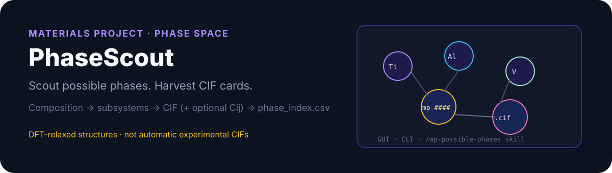

<p align="center">
  
</p>

# PhaseScout

**Scout possible phases. Harvest CIF cards from the Materials Project.**

Desktop + CLI toolkit for materials researchers:

- Paste an alloy grade or chemical system (`Ti-6Al-4V`, `Ti-Al-V-Cu`, wt% text)
- Expand **subsystem** phase candidates on [Materials Project](https://materialsproject.org/)
- Download **CIF** files (optional elasticity / Cij)
- Keep a clean `phase_index.csv` catalog per batch

> **Important:** Materials Project structures are usually **DFT-relaxed**. They are not automatically equivalent to experimental CIFs. Check phase identity, cell, space group, and provenance before XRD / Rietveld / MAUD work.

## Paths

| Path | What it does |
|------|----------------|
| **GUI** | `run_gui.bat` / `app.py` — search by MP-ID or chemsys, download CIFs |
| **CLI** | `scripts/fetch_possible_phases.py` — composition → possible-phase batch |
| **Agent skill** | `/mp-possible-phases` — project skill at `.grok/skills/mp-possible-phases/` |

## Quick start

### 1. Install

```powershell
git clone https://github.com/D-sudoasd/PhaseScout.git
cd PhaseScout
py -3.12 -m venv .venv
.\.venv\Scripts\activate
python -m pip install -r requirements.txt
```

### 2. API key

Get a key from Materials Project, then either:

```powershell
setx MP_API_KEY "your_key_here"
```

or copy the example config (never commit the real file):

```powershell
copy config\settings.example.json config\settings.json
```

`config/settings.json` is gitignored.

### 3. GUI

```powershell
.\run_gui.bat
# or: python app.py
```

### 4. CLI — composition → possible phases

```powershell
# Preview (index only)
python scripts\fetch_possible_phases.py "Ti-6Al-4V + Cu" --dry-run --label Ti6Al4VCu

# Download (add --yes if more than 200 candidates)
python scripts\fetch_possible_phases.py "Ti-6Al-4V" --mode possible_phases --label Ti6Al4V --yes

# Near-stable filter
python scripts\fetch_possible_phases.py "Ti-Al-V" --mode near_stable --e-hull-max 0.05 --yes

# Near-stable + Cij
python scripts\fetch_possible_phases.py "Ti-Al-V" --mode near_stable --e-hull-max 0.05 --elasticity --yes

# Explicit MP-IDs
python scripts\fetch_possible_phases.py --mode mpids_only --mpids "mp-23,mp-149" --label selected --yes
```

Batches land under `downloads/0N_<label>/`:

- `phase_index.csv` — catalog (`elasticity_status` / `elasticity_source` when requested)
- `query_summary.txt`, `run_manifest.json`
- scheme-B CIF names (mp-id first; see below)
- with `--elasticity`: `*_elasticity.json`, `elasticity_index.csv`
- MP Cij miss → `elasticity_web_search.csv` (+ literature hits; not fake tensors)

Full flags: [docs/CLI.md](docs/CLI.md).

## CIF filename scheme (B)

```text
mp-134_Al_FCC_sg225_Fm-3m_ehull0_stable.cif
```

| Segment | Meaning |
|---------|---------|
| `mp-xxxx` | Materials Project ID |
| formula | Reduced formula |
| **TYPE** | Heuristic structure type (`FCC`/`BCC`/`HCP`/`L12`/`B2`/…) |
| `sgN` + symbol | Space group |
| `ehull…` | Energy above hull (eV/atom); `p` = decimal point |
| `stable` | Only when MP marks the entry stable |

TYPE is inferred when SG+formula allow. **L12 needs Pm-3m (221)+3:1**; binary 3:1 in Fm-3m (225) → **DO3**, not L12.

## Cij provenance (anti black-box)

| Artifact | Provenance |
|----------|------------|
| `*_elasticity.json` → `provenance` | provider, API, MP URLs, DFT flag |
| `elasticity_index.csv` | nature of data, methodology URL, disclaimer |
| `Cij_PROVENANCE.txt` | batch-level how-to-cite |
| web pack | literature hints only (`numerical_cij=false`) |

| Tier | Source | What you get |
|------|--------|----------------|
| 1 | Materials Project | Numerical 6×6 Cij (GPa) when available |
| 3 | Internet / OpenAlex | Search pack + DOIs for **missing** MP entries — not auto-extracted tensors |

## Downstream: CIF2Peaks

Sibling project **CIF2Peaks** reads the same batch folder. Guide: [docs/INTEROP_CIF2PEAKS.md](docs/INTEROP_CIF2PEAKS.md).

1. PhaseScout writes `*.cif` + `*_elasticity.json` + `cif2peaks_manifest.json`.
2. Open CIF2Peaks → add/drag the batch directory.
3. Sidecars auto-load (`[Cij]` when `status=ok`).
4. Export Excel → `young_modulus_hkl_normal_GPa` + Elastic Constants sheet.

CLI: `cif2peaks path\to\batch_folder -o peaks.xlsx` (default `--auto-elastic`).

## Project layout

```text
PhaseScout/
  app.py · mp_client.py · composition_parse.py · elasticity_web.py
  run_gui.bat
  scripts/fetch_possible_phases.py
  .grok/skills/mp-possible-phases/
  config/settings.example.json
  downloads/          # runtime only (gitignored)
  tests/ · docs/
```

Agent skill: `.grok/skills/mp-possible-phases/SKILL.md` · slash `/mp-possible-phases`. Agents should call the CLI only — see `AGENTS.md`.

## Tests

```powershell
python -m unittest discover -s tests -v
```

## Security

- Do **not** commit API keys or share `config/settings.json`.
- Runtime CIF libraries under `downloads/` are local by default.
- If a key was exposed, regenerate it in the Materials Project dashboard.

## License

MIT — see [LICENSE](LICENSE).

## Disclaimer

PhaseScout is an independent helper tool. It is not affiliated with or endorsed by the Materials Project. Use of the Materials Project API is subject to their terms of use.
