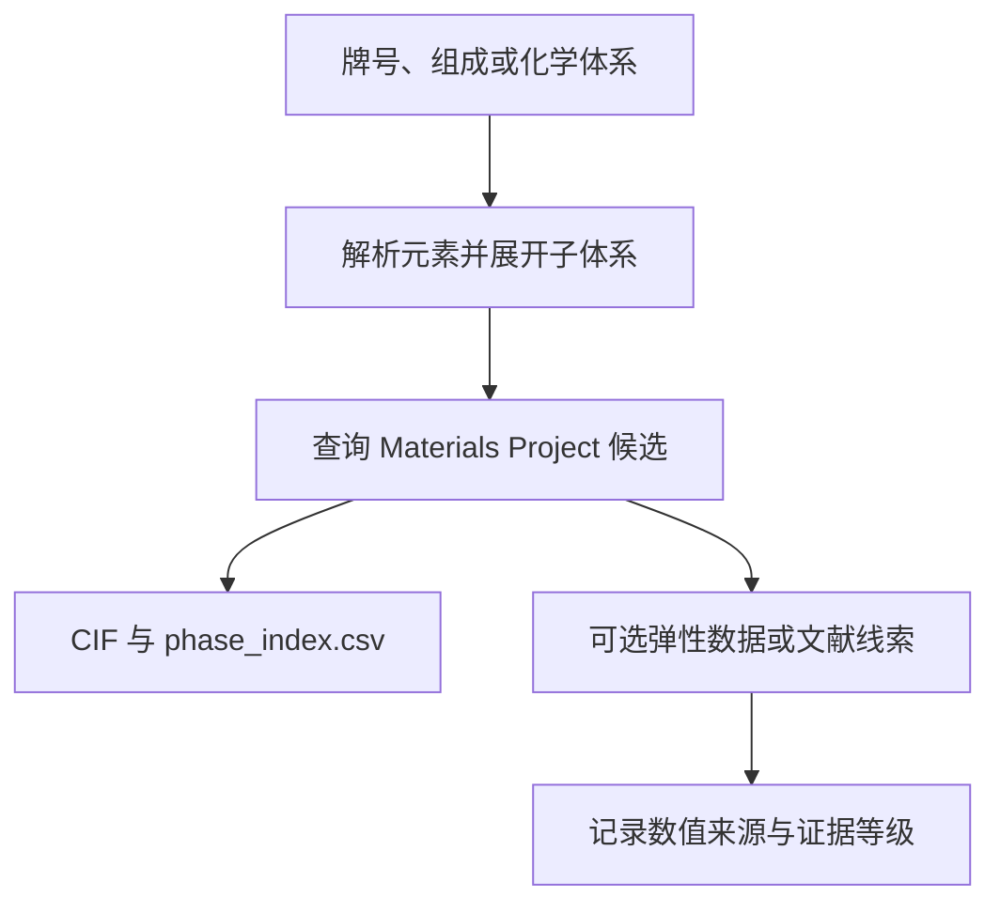

# PhaseScout

**从合金牌号或化学体系检索 Materials Project 候选结构，下载 CIF 并保留来源索引。**

A GUI and CLI toolkit for subsystem expansion, candidate-phase queries, and CIF collection with optional elasticity records. It helps assemble traceable theoretical structure references for later diffraction work.

> **Archived / 已归档。** 本仓库保留历史实现与使用方法。[DiffractScout 完整版](https://github.com/D-sudoasd/DiffractScout/blob/main/docs/REPLACEMENT_AUDIT.md)包含对应兼容工作台；转换前核对引擎和功能差别。

[安装与 API 密钥](#install--quick-start) · [CLI 示例](#cli-examples) · [来源等级](#elasticity-provenance) · [命令参数](docs/CLI.md)

[](LICENSE) [](pyproject.toml)


```mermaid
flowchart TD
  A[牌号、组成或化学体系] --> B[解析元素并展开子体系]
  B --> C[查询 Materials Project 候选]
  C --> D[CIF 与 phase_index.csv]
  C --> E[可选弹性数据或文献线索]
  E --> F[记录数值来源与证据等级]
```

Materials Project 结构通常为 DFT 弛豫结构，不能自动视为实验 CIF。弹性文献线索与数值 `Cij` 分别保存；查询结果需要核对物相、晶胞、空间群和来源后使用。

## Features

| Path | Entry |
|------|--------|
| **GUI** | `run_gui.bat` / `app.py` |
| **CLI** | `scripts/fetch_possible_phases.py` |
| **Agent skill** | `/mp-possible-phases` → `.grok/skills/mp-possible-phases/` |

- Alloy-grade / chemical-system parsing → subsystem expansion
- Modes: `possible_phases`, `near_stable` (e.g. energy-above-hull cutoff)
- Optional elasticity harvest with explicit provenance tiers
- Scheme-B CIF naming; batches under `downloads/0N_<label>/`
- Downstream bridge to [CIF2Peaks](https://github.com/D-sudoasd/CIF2Peaks)

## Install / Quick start

Requires a free Materials Project API key.

```powershell
git clone https://github.com/D-sudoasd/PhaseScout.git
cd PhaseScout
py -3.12 -m venv .venv
.\.venv\Scripts\activate
python -m pip install -r requirements.txt
$env:MP_API_KEY = "your_key_here"
# Applies to this PowerShell session / 仅用于当前 PowerShell 会话
# or: copy config\settings.example.json config\settings.json
.\run_gui.bat
```

## CLI examples

```powershell
python scripts\fetch_possible_phases.py "Ti-6Al-4V" --mode possible_phases --label Ti6Al4V --yes
python scripts\fetch_possible_phases.py "Ti-Al-V" --mode near_stable --e-hull-max 0.05 --elasticity --yes
```

See [docs/CLI.md](docs/CLI.md) for flags and batch layout.

## Elasticity provenance

<p align="center">
  
</p>

| Tier | Source | Output |
|------|--------|--------|
| 1 | Materials Project | Numerical 6×6 Cij when available |
| 3 | OpenAlex / web | Literature hints only — **not** fake tensors |

Artifacts: `*_elasticity.json` · `elasticity_index.csv` · `Cij_PROVENANCE.txt`

**Downstream:** CIF2Peaks auto-loads the same folder — [docs/INTEROP_CIF2PEAKS.md](docs/INTEROP_CIF2PEAKS.md)

## Scientific boundary — what it is NOT

- **Not** an experimental CIF database or ICSD replacement
- **Not** automatic phase identification against measured XRD
- DFT-relaxed cells may differ from room-temperature experimental structures
- Never invents Cij: missing elasticity stays missing / literature-hint only

## Tests · Security · License

```powershell
python -m unittest discover -s tests -v
```

Never commit API keys. MIT. Not affiliated with Materials Project.
